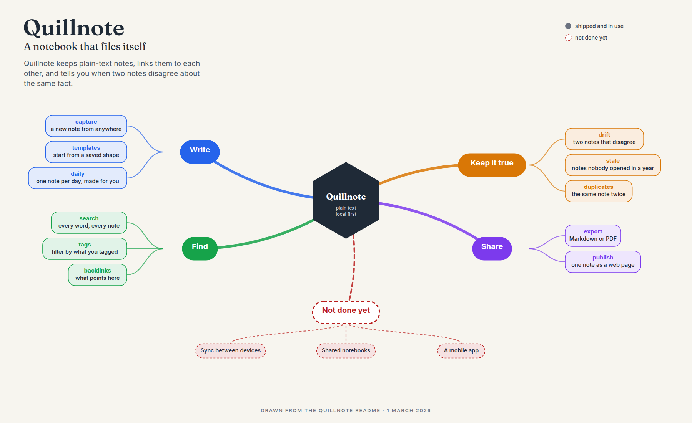

# feature-map

**Draw what a tool does as one picture, from a plain outline.**

A tool that keeps growing gets hard to hold in your head. Its README lists every flag, and nobody reads a README to learn what it's for. A feature map is the other view: every capability grouped by the job it does, around the tool's name, with the work that is not done yet drawn in dashes beside the rest.



**It refuses to draw a map that cannot be checked.** Every outline says where its list came from, and that source is printed on the map. A map with no source, or one that names the same feature twice, isn't drawn: you get an error instead.

## Try it

You'll need Python 3 and nothing else. Drawing a PNG also needs a Chromium-based browser.

```bash
make example
```

That draws the bundled example into `local.d/`. To draw your own:

```bash
bin/feature-map render my-tool.md -o my-tool.png
```

## Write an outline

```markdown
# Quillnote
> A notebook that files itself
One line about what it is for.

source: the Quillnote README
date: 1 March 2026

## Write
- **capture**: a new note from anywhere
- **daily**: one note per day, made for you

## Not done yet [planned]
- Sync between devices
```

Each `##` is a branch and each `-` is a feature. `**name**:` gives a feature a bold name. `[planned]` draws a branch or an item dashed, in red. **The full format, and what is refused, is in [docs/format.md](docs/format.md).**

## Keep it true

A map drawn by hand falls behind its tool. `draft` writes a first outline from the tool's own help text, and `drift` tells you when the two disagree, silently when they don't. **Neither runs anything for you**: pipe the help in.

```bash
mytool --help | feature-map drift mytool.md help -
```

Details are in [docs/format.md](docs/format.md#drafting-from-a-tool-and-checking-a-map-against-it).

## Draw a Compose stack (experimental)

```bash
docker compose config --no-interpolate --format json | feature-map stack - -o stack.png
```

draws the services and how they connect, in the same visual language as the feature map. `--no-interpolate` keeps secrets as `${VARIABLE}` placeholders, and the diagram shows a variable's name, or the default the file gives it, never the value from your environment. **Keep the flag**: without it, Compose also copies every `env_file` into its output, values and all (seen with Compose 2.31). The diagram never draws environment variables either way, but the JSON you pipe in would hold them. [`examples/shop-stack.json`](examples/shop-stack.json) is an invented stack to try it on.

It lays a stack out along its request path from what Compose declares: `depends_on`, profiles, networks, ports and named volumes. A service that other services wait on to finish is drawn as start order rather than as a path, and three or more services that differ only in their names are drawn once with a count.

**A stack that runs as several Compose projects** is drawn as one picture. Give each project a label:

```bash
feature-map stack site=site.json data=data.json --title Tinyshop -o stack.png
```

A network one project declares and another joins as external becomes a single line between their boxes. They are matched on the variable that names the network, or on its default, so the two files don't need to agree on a literal name. Two projects can both have a `db`: each is drawn under its project's label, as `site/db` and `data/db`.

**It has been tried on stacks of about twenty services**, one of them split across two projects; much larger ones may need grouping it does not do yet.

## Outputs

| Format | For | Needs |
| --- | --- | --- |
| `svg` | A standalone image, or embedding in a page | nothing |
| `html` | The SVG with its web fonts, for viewing in a browser | nothing, though opening it fetches the fonts from Google Fonts |
| `png` | Posting, slides, a README | a Chromium-based browser on `PATH`, or its path in `FEATURE_MAP_BROWSER`; it fetches the fonts from Google Fonts too |
| `mermaid` | The same map as a tree, for Markdown that renders Mermaid | nothing |

The format follows the output file's extension (`.svg`, `.html`, `.png`, `.mmd`), or `--format` says it. Without `-o`, `svg` and `mermaid` go to standard output.

```bash
bin/feature-map check my-tool.md
```

prints what the outline holds, and exits 1 if it would be refused.

## Commands

| Command | Does |
| --- | --- |
| `make help` | The list |
| `make check` | Compile, lint if `ruff` is installed, and run the tests |
| `make example` | Draw the bundled example into `local.d/` |
| `make map SPEC=… OUT=…` | Draw one outline |
| `make install` | Put `feature-map` in `PREFIX`, default `~/bin` |
| `make uninstall` | Remove it again |
| `feature-map render MAP -o FILE` | Draw a map |
| `feature-map check MAP` | Say what an outline holds, and exit 1 if it would be refused |
| `feature-map draft help -` | Draft an outline from a tool's help text on standard input |
| `feature-map drift MAP help -` | Say what the tool has that the map doesn't show, and the reverse |
| `feature-map stack FILE... -o FILE` | Draw a Docker Compose stack, from one project or several |

**Exit codes:** 0 done; 1 the input is refused, the map has drifted, or a draft found no commands; 2 bad usage, a missing file, or an output folder that doesn't exist; 3 the PNG couldn't be drawn.

## What it does not do

- **It doesn't read your code.** It reads what the tool says about itself: its help text or its Makefile. The map is as true as the outline, which is why it prints its source and why `drift` exists.
- **The layout is automatic and fixed in style**: groups to the left and right of the centre, the first planned group below it. There's no theme option yet.
- **Text widths are estimated**, so a pill can come out a little wide. Pills never overlap, beside the centre or in the planned row under it, and the tests check both on crowded maps.

## Licence

MIT. See [LICENSE](LICENSE).
